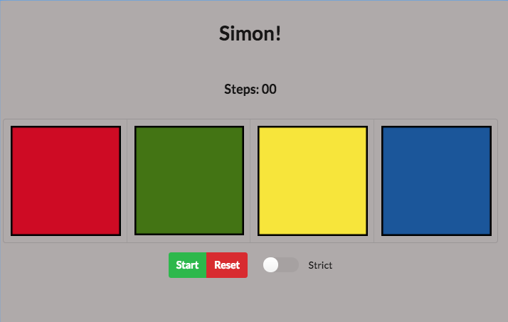

# Simon Game

Simon was an electronic game of memory skill invented by Ralph H. Baer and Howard J. Morrison, with software programming by Lenny Cope. The device created a series of tones and lights and required a user to repeat the series. If the user succeeded the series became progressively longer and more complex. Once the user failed, the game was over.

## Free Code Camp

This project is part of the course work for the [Front End Development Program](https://www.freecodecamp.org/challenges/claim-your-front-end-development-certificate).

## Screen Captures

